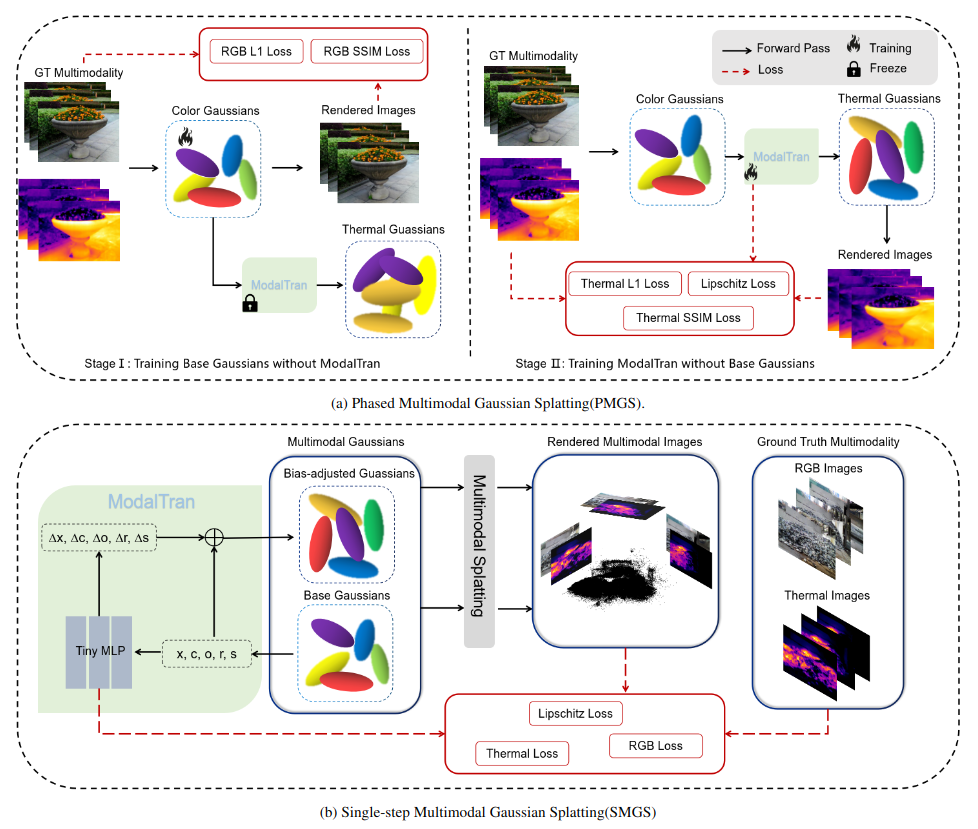
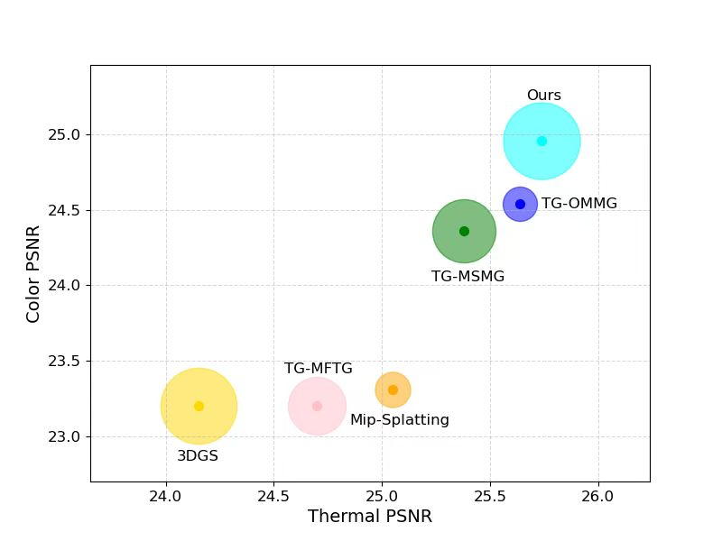

<p align="center">
  <h1 align="center"> Co-Enhanced 3D Gaussians Splatting for RGB-Thermal Novel-View Synthesis</h1>
  <p align="center"> Jiamiao Dong, Haofan Ren, Zunjie Zhu, Zengxin Chen, Yuxiang Zhang</p>
  <p align="center"> Hangzhou Dianzi University</p>
</p>

<h4 align="center">
    <p>
        <a href="#-introduction">Introduction</a> |
        <a href="#-Method Overview">Method Overview</a> |
        <a href="#-key-contributions">Key Contributions</a> |
        <a href="#-ToDos">ToDos</a> |
        <!-- <a href="#-getting-started">Getting Started</a> | -->
        <a href="#-datasets">Datasets</a> |
        <a href="#-main-results">Main Results</a> |
        <a href="#-acknowledgements">Acknowledgements</a> |
        <a href="#-contact">Contact</a>
    <p>
</h4>

## 🌀 Introduction

This repository contains the official implementation of the paper:

<p align="center"><b>
Co-Enhanced 3D Gaussians Splatting for RGB-Thermal Novel-View Synthesis
</b></p>

We introduce CEGS, a novel multimodal framework based 3D gaussian splatting, which leverages mutual supervision between RGB and thermal modalities, enabling the high-quality multimodal reconstruction. Through comprehensive experiments, we demonstrate that our method produces photorealistic thermal image renderings and outperforms existing approaches.

## 🚀 Method Overview

Overview of the proposed method. (a) PMGS: We first train the color Gaussians solely in the RGB modality with freezing the thermal gaussians (as shown in b). Then, we train the thermal Gaussians using a tiny multi-layer perceptron (MLP) within ModalTran, to reconstruct realistic multimodal scenes. (b) SMGS: We simultaneously construct the color gaussians and the thermal Gaussians, each used for rendering in their respective scenes. The thermal Gaussians are transformed using a tiny MLP within ModalTran. This strategy enables the simultaneous rendering of RGB and thermal modalities, unlike the two-stage process used in PMGS. Similarly, the reverse approach(RSGS) can still be applied, where the Base Gaussians are used to render the thermal images and the Bias-adjusted Gaussians are used to render the color images.

<p align="center">
    
</p>

## 🔍 Key Contributions

- We propose CEGS, the multimodal 3DGS-based method that enables the simultaneous rendering of photorealistic thermal and RGB images of a scene.

- We propose different single-step and multi-step multimodal Gaussian reconstruction strategies, where the Base Gaussians are transformed into Bias-adjusted Gaussians using an tiny MLP. These Gaussians are then employed to render RGB and thermal modality. Notably, the multi-step method remains effective even when reversed.

- We introduce an MLP loss function based on Lipschitz continuity to improve the stability and generalization capability, thereby facilitating a smoother convergence of the training loss.

- We introduce 3D smooth filter to significantly improves the novel view synthesis RGB and thermal results.

- We perform extensive experiments to show that our multimodal approach not only enhances the rendering quality of thermal images but also improves the quality of RGB rendering.

## ✅ ToDos
🔥 Feel free to raise any requests~
- [x] Release github page.
- [ ] Release paper.
- [ ] Release training codes.

## 📦 Dataset

### RGBT-Scenes
For the RGBT-Scenes dataset, download the dataset from [ThermalGaussian](https://github.com/chen-hangyu/Thermal-Gaussian-main), the dataset should look as follows:
```
<location>
|---rgb
|    |---test
|    |    |---<image 0>
|    |    |---<image 8>
|    |    |---...
|    |---train
|    |    |---<image 1>
|    |    |---<image 2>
|    |    |---...
|---thermal
|    |---test
|    |    |---<image 0>
|    |    |---<image 8>
|    |    |---...
|    |---train
|    |    |---<image 1>
|    |    |---<image 2>
|    |    |---...
|---colmap
    |---sparse
         |---0
            |---cameras.bin
            |---images.bin
            |---point3D.bin
```
### ThermalMix
For the ThermalMix dataset, download the training dataset from [ThermalNeRF](https://mert-o.github.io/ThermalNeRF/) website, the dataset is same as RGBT-Scenes.

## 📈 Main Results

Our method demonstrates strong performance improvements on real-world benchmarks. 

| Method | Thermal PSNR↑ | Color PSNR↑ | Average FPS↑ |
|:---|:---:|:---:|:---:|
| 3DGS+MI | 24.15 | 23.20 | 348.82 |
| Mip-Splatting | 25.05 | 23.31 | 246.14 |
| MFTG | 24.70 | 23.20 | 316.01 |
| MSMG | 25.38 | 24.36 | 314.23 |
| OMMG | 25.64 | 24.54 | 256.51 |
| Thermal3DGS | 25.20 | 24.27 | 64.14 |
| Ours_SM | 25.19 | 24.21 | 246.99 |
| Ours_PM | 25.74 | 24.92 | 385.65 |
| Ours_RS | 25.19 | 24.27 | 238.73 |

The performance scatter plot across different multimodal models demonstrates that our method outperforms existing synthesis approaches. In this plot, the x-axis represents the Thermal PSNR, the y-axis represents the Color PSNR, and the size of each circle indicates the inference speed measured in FPS (Frames Per Second).

<p align="center">
  
</p>  


## 🙏 Acknowledgements

Our code is based on the famous pytorch reimplementation of [**3D Gaussian Splatting**](https://github.com/graphdeco-inria/gaussian-splatting). We appreciate all the contributors.


## 📬 Contact

For questions or suggestions, please open an issue or contact us at: djm@hdu.edu.cn.
